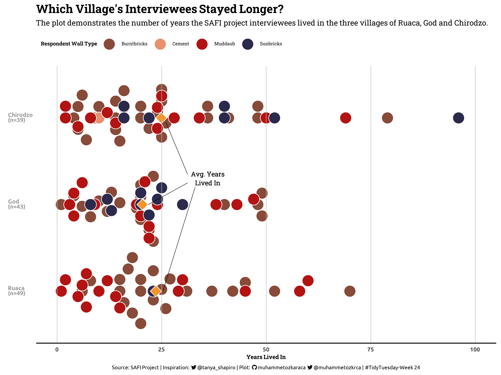
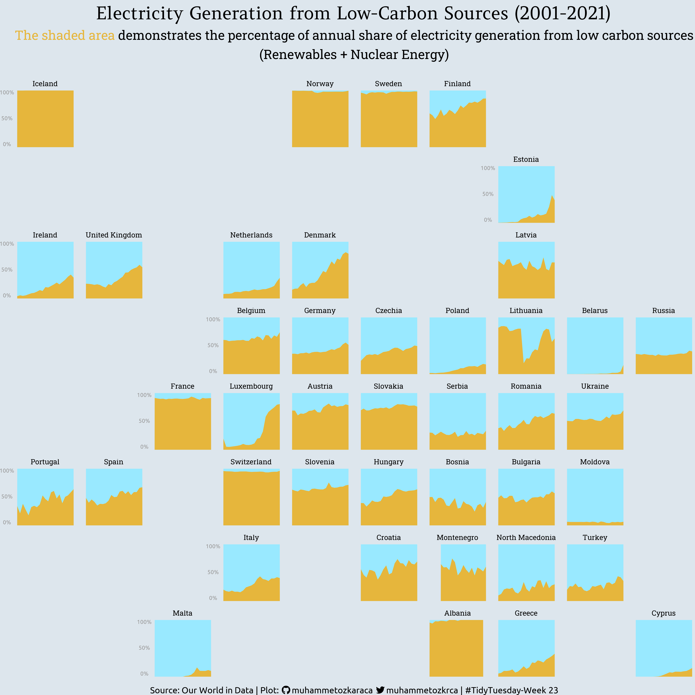
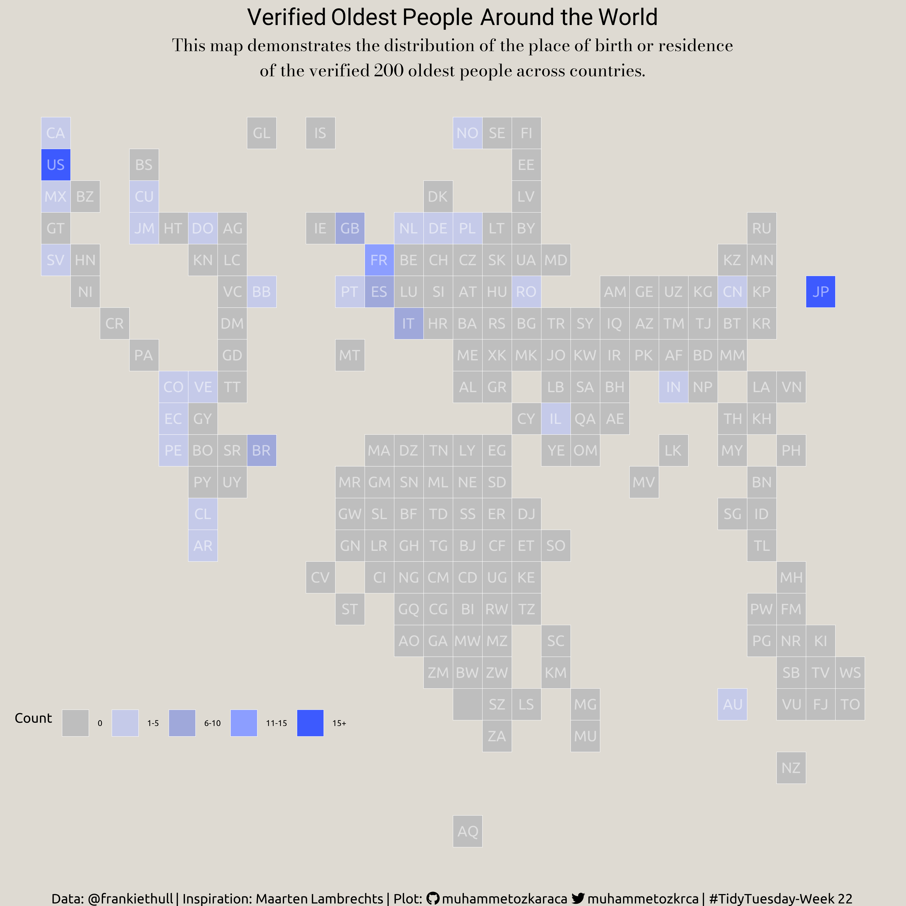
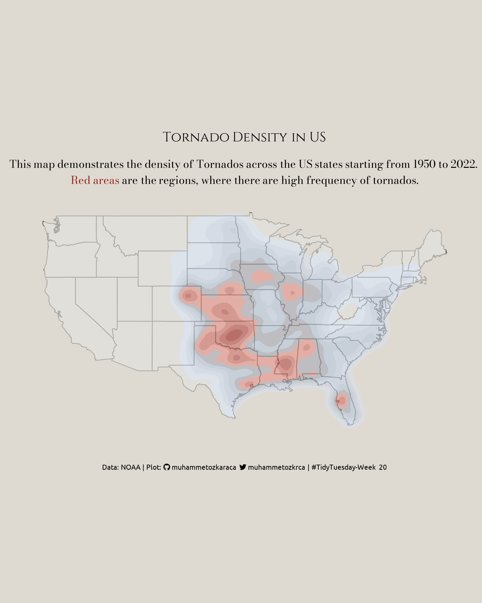
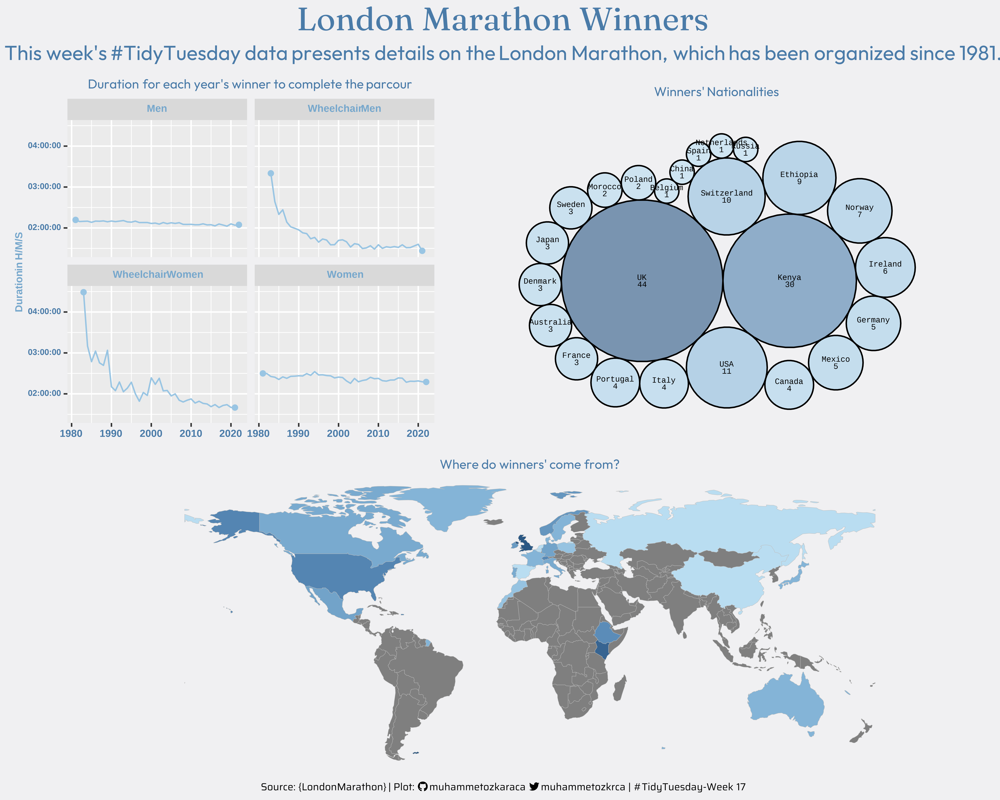
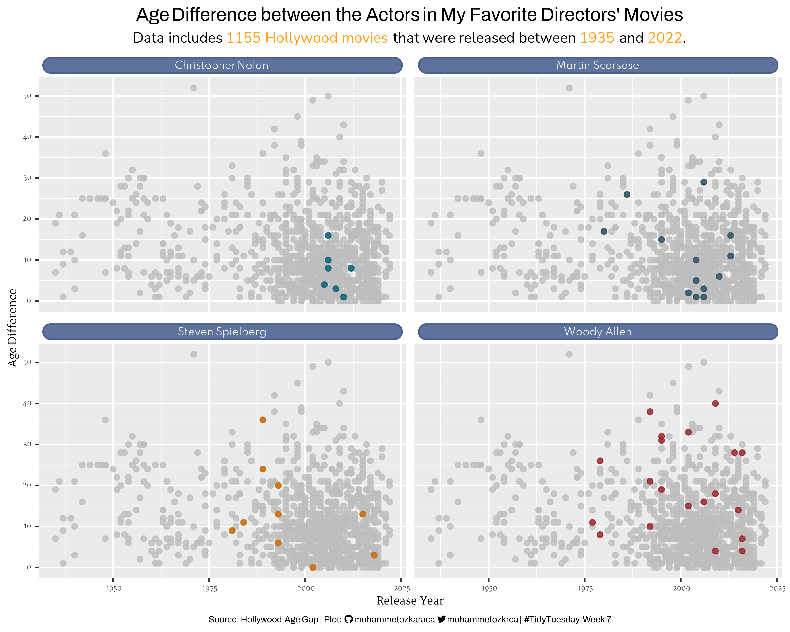
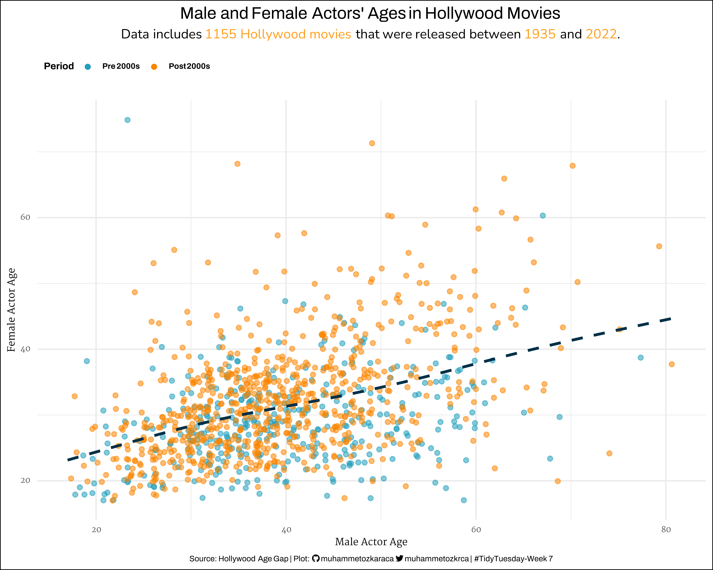
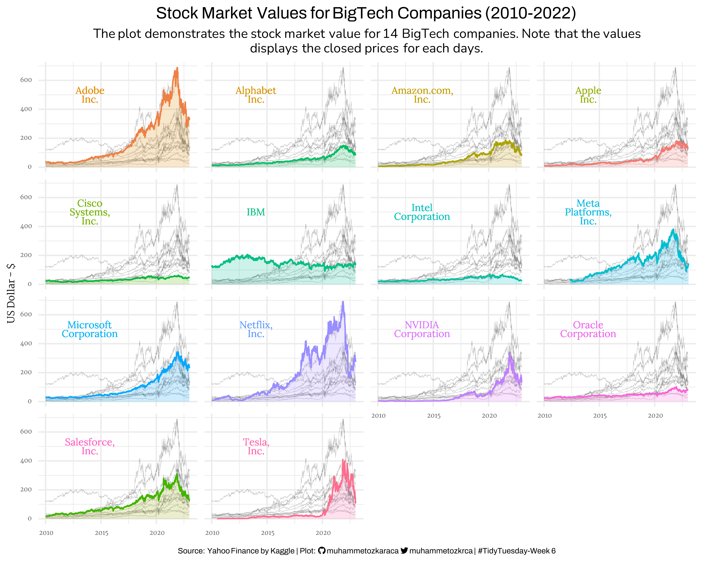
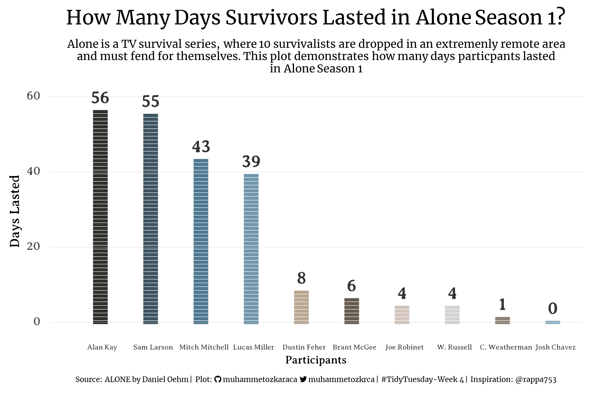

# TidyTuesday

## Sub-Repositories

The visualizations I made to contribute to the `TidyTuesday` challenge on an annual basis can be found at the following links: 

- [TidyTuesday 2023](2023)
- [TidyTuesday 2022](2022)

## 2023 Contributions

### **[Week 24 - SAFI Project](2023/Week_24_SAFIProject)**

### **[Week 23 - Energy](2023/Week_23_Energy)**

### **[Week 22 - Verified Oldest People](2023/Week_22_OldestPeople)**

### **[Week 20 - Tornados](2023/Week_20_Tornados)**

### **[Week 17 - London Marathon](2023/Week_17_LondonMarathon)**

### **[Week 17 - London Marathon](2023/Week_17_LondonMarathon)**

### **[Week 7 - Hollywood Age Gap](2023/Week_7_HollywoodAge)**

### **[Week 6 - BigTech Companies](2023/Week_6_BigTech)**

### **[Week 4 - Survivors](2023/Week_4_Survivors)**

